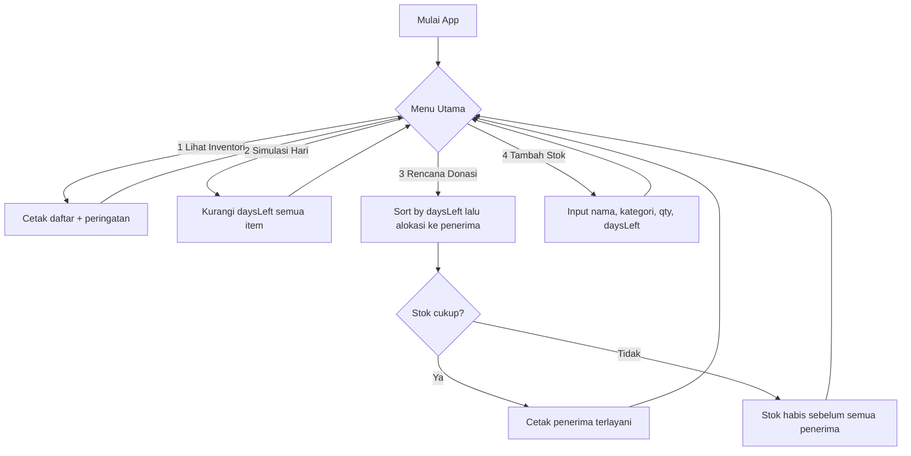

# Food Rescue Planner (Dart Console) ♻️

> Simulator sederhana untuk mengurangi food waste melalui pemantauan inventori, simulasi kedaluwarsa, dan perencanaan donasi. Ditulis dengan Dart console dan disusun agar memenuhi praktik percabangan, perulangan, serta workflow Git.

## Identitas Mahasiswa
- **Mata Kuliah**: Pemrograman Mobile  
- **Dosen Pengampu**: Ade Ismail, S.Kom., M.TI  
- **Nama**: Aqueena Regita Hapsari  
- **NIM**: 2341760096  
- **Kelas**: SIB 3C  
- **No Absen**: 06

---

## Pendahuluan
Limbah pangan adalah masalah global yang berdampak pada lingkungan dan sosial. Laporan UNEP 2024 memperkirakan sekitar 1,05 miliar ton makanan terbuang pada 2022. Rata-rata sekitar 79 kg per orang per tahun. Target SDG 12.3 mendorong pengurangan limbah pangan per kapita dan penurunan food loss sepanjang rantai pasok. Proyek ini menghadirkan simulasi kecil untuk mempraktikkan pengelolaan stok: memantau sisa hari kedaluwarsa, memberi prioritas pada item yang mendekati kedaluwarsa, dan menyalurkannya ke penerima manfaat.

---

## Manfaat Proyek
- Edukasi dan kesadaran pengelolaan stok pada tingkat rumah tangga atau warung.
- Dampak sosial melalui rencana donasi item yang mendekati kedaluwarsa.
- Latihan teknis percabangan dan perulangan di Dart serta praktik Git yang rapi.

---

## Fitur dan Tujuan 🎯
1. **Lihat Inventori**  
   Menampilkan daftar item beserta peringatan jika hampir atau sudah kedaluwarsa.  
   Tujuan: membantu keputusan cepat agar waste menurun.

2. **Simulasikan Hari Berlalu**  
   Mengurangi `daysLeft` per item per hari.  
   Tujuan: memvisualisasikan urgensi waktu terhadap kualitas stok.

3. **Rencanakan Donasi**  
   Mengalokasikan stok ke penerima dengan prioritas item yang `daysLeft` paling kecil.  
   Tujuan: mengalihkan stok berisiko terbuang menjadi manfaat sosial 🍞

4. **Tambah Stok**  
   Menambah item baru dengan kategori melalui `switch-case`.  
   Tujuan: menjaga data inventori tetap mutakhir sehingga fitur lain efektif.

---

## Gambaran Besar Aplikasi
Diagram ini menunjukkan alur utama aplikasi dari input pengguna sampai keputusan donasi.

---

## Referensi 
1. UNEP: Food Waste Index Report 2024: estimasi global food waste 2022 (skala, kontribusi per sektor, ~79 kg/kapita/tahun), dan panduan metodologis indikator SDG 12.3.1(b). [UNEP - UN Environment Programme+2SDG2 Advocacy Hub](https://www.unep.org/resources/publication/food-waste-index-report-2024) 
2. FAO: Global Food Losses and Food Waste: kajian klasik bahwa ±1/3 pangan global hilang/terbuang (±1,3 miliar ton/tahun). [FAOHome](https://www.fao.org/4/mb060e/mb060e00.htm?)
3. UN DESA: SDG 12.3: target 2030 untuk mengurangi setengah limbah pangan per kapita serta menurunkan food loss di sepanjang rantai pasok. [Sustainable Development Goals](https://sdgs.un.org/goals/goal12?)
4. Montoli et al. (2023): _Food donation as a strategy to reduce food waste and improve food security_ serta peran donasi surplus pada penurunan limbah dan peningkatan ketahanan pangan. [PMC](https://pmc.ncbi.nlm.nih.gov/articles/PMC10124677/?)
5. ReFED (2025): potensi dan kesenjangan donasi di AS; donasi sebagai strategi kunci menyelamatkan pangan dari TPA. [ReFED](https://refed.org/downloads/refed-us-food-waste-report-2025.pdf?)
6. UNEP Press Release (2024): ringkasan temuan kunci “1 miliar porsi makanan terbuang per hari; 60% dari rumah tangga.” [UNEP - UN Environment Programme](https://www.unep.org/news-and-stories/press-release/world-squanders-over-1-billion-meals-day-un-report?)
